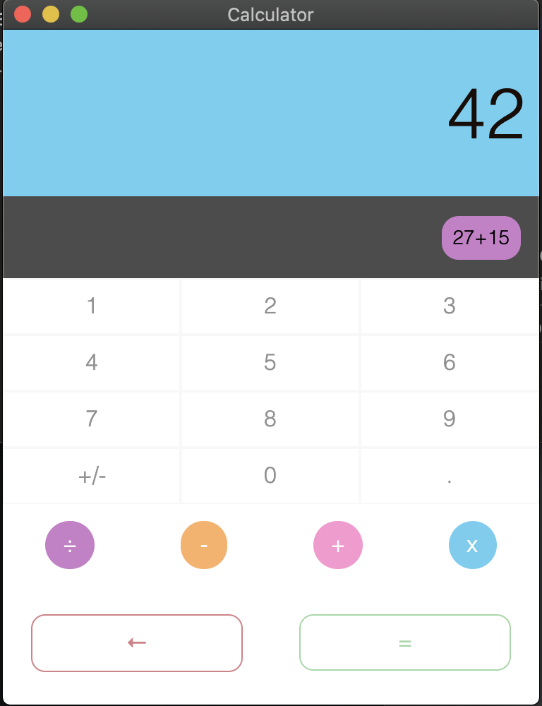

# Calculator Electron & Web App
React Calculator built using shadow-cljs, reagent



Inspiration: https://github.com/benoitvallon/react-native-nw-react-calculator

## Run

``` shell
npm install

npm run watch
```
### Web App
Go to http://localhost:8700

### Electron App
``` shell
npx electron .
```

## Clean

``` shell
npm run clean
```

## Release

``` shell
npm run build

npx electron-packager . Calculator --platform=darwin --arch=x64 --app-version=1.0.0
```
